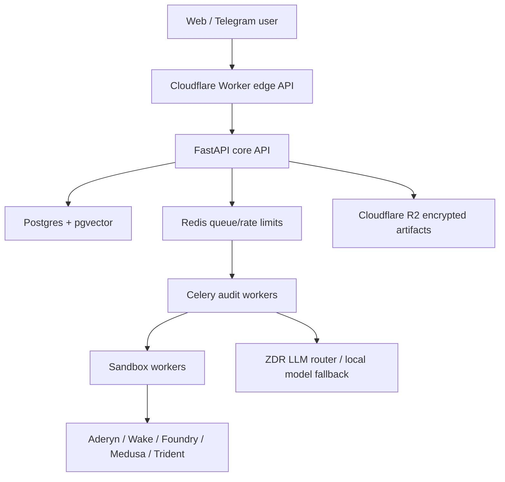

# wr3 Architecture

wr3 is an AI-assisted smart-contract pre-audit and exploitability triage
platform. The MVP is EVM-first with Solana kept as a beta/research branch.

## Monorepo Layout

- `apps/web`: Next.js 15 scan and report UI.
- `apps/api`: FastAPI core API and in-memory MVP orchestration.
- `packages/types`: canonical TypeScript contracts for audit inputs, findings,
  engine results, artifacts, scoring, and audit states.
- `packages/scoring`: deterministic `wr3-score-v0.1` implementation.
- `packages/audit-engine`: ingestion, explorer puller contracts, engine adapter
  contracts, fixture adapter, and external CLI adapter shells.
- `packages/shared`: compatibility facade re-exporting public TS contracts.
- `infra`: local infrastructure and deployment stubs.
- `docs`: product, safety, API, scoring, and backlog documentation.

## MVP Request Flow

1. User submits chain + address/source in `apps/web`.
2. `POST /v1/audits` validates input, creates an audit record, moves it to
   `queued`, and schedules a background processing task.
3. The report UI polls status through `router.refresh()` while the job is in a
   non-terminal state.
4. Ingestion accepts pasted source, pulls verified source from configured
   Etherscan-family explorers, or returns `needs_source`.
5. Static adapters run in parallel:
   - Aderyn subprocess shell, skipped if binary is absent.
   - Wake subprocess shell, skipped if binary is absent.
   - Slither subprocess shell, skipped if binary is absent.
   - wr3 deterministic heuristic adapter for local MVP signal.
   - wr3 Solana beta heuristic adapter for Anchor/Rust footguns.
6. LLM triage routing records the intended ZDR provider/model boundary and wraps
   source in `UNTRUSTED_CONTRACT_SOURCE`. If OpenRouter is configured, four
   role prompts run for severity, false-positive, business-logic, and
   cross-contract analysis with `zdr: true` and
   `provider.data_collection: deny`; otherwise local MVP falls back to
   deterministic triage.
7. Multi-agent consensus records metadata-only verdicts after provider or
   deterministic triage.
8. Standard/deep scans enter a Foundry PoC worker boundary. The current worker
   enforces tier/scope gates, runs a bounded retry loop when `forge` is present,
   stores private artifacts when encryption is configured, and never marks an
   exploit confirmed without an explicit isolated-test confirmation marker.
9. Deep Team/Pro scans enter the AI-fuzzing worker boundary. Medusa/ItyFuzz
   commands are sandbox-validated and recorded as skipped until binaries and
   invariant generation are configured.
10. Scoring applies `wr3-score-v0.1`.
11. Report renderer returns Markdown/HTML with disclaimer, limitations, findings,
   score breakdown, and engine versions.
12. Event log records metadata-only state transitions, source-pull events, and
   metadata-only PoC/fuzzing worker results.

## Queue Boundary

The local MVP uses FastAPI background tasks as the default in-process
dispatcher. `AuditService.create_audit` only creates and queues a record, while
`AuditService.process_audit` owns ingestion, static analysis, triage, and
scoring. `wr3_api.services.dispatcher` can switch to Celery with
`WR3_TASK_BACKEND=celery`; if the worker extra or Redis is unavailable, the API
falls back to the local dispatcher and records a limitation. Production Celery
tasks live under `wr3_api.workers`.

## Persistence Boundary

The API defaults to in-memory repositories for frictionless local development.
When `WR3_DATABASE_URL` is set, repository factories switch to the Postgres
implementation in `apps/api/wr3_api/services/repository.py`. The repository
still round-trips `AuditRecord` and `DisclosureCase` through JSONB payloads for
early velocity, while `infra/postgres/001_core_schema.sql` also declares the
normalized data model from the spec: `users`, `auth_accounts`, `projects`,
`contracts`, `audit_jobs`, `audit_events`, `engine_runs`, `findings`,
`artifacts`, `subscriptions`, `disclosure_cases`, `benchmark_runs`, and
`watchlist_entries`.

## Artifact Boundary

`ArtifactVault` writes public manifests locally, but refuses sensitive artifact
kinds (`source`, `raw_output`, `finding`, `poc`, `fuzzer_counterexample`,
`private_report`) unless `WR3_ARTIFACT_ENCRYPTION_KEY` is configured and the
`secure` Python extra is installed. This keeps the local MVP honest: private
artifacts do not silently fall back to plaintext storage.

## LLM Triage Boundary

`LlmTriageRouter` is the only place security triage may choose a model/provider.
It requires ZDR by default, refuses to silently call non-configured providers,
and records a metadata-only `llm_triage_route` event. OpenRouter calls use the
Chat Completions-compatible endpoint with `zdr: true` and
`provider.data_collection: deny`, matching OpenRouter's ZDR/provider-routing
controls. The prompt preview wraps source with
`UNTRUSTED_CONTRACT_SOURCE_BEGIN/END` so comments and NatSpec are treated as
hostile data, not instructions.

## Sandbox Command Boundary

Generated tool commands must pass `SandboxPolicy` before any subprocess worker
may execute them. The policy accepts argv arrays, rejects shell syntax and
dangerous Foundry flags such as `--ffi`, blocks path escapes, and allows RPC
egress only to `WR3_SANDBOX_ALLOWED_RPC_HOSTS`. PoC and fuzzing workers use
this policy before subprocess execution.

## Knowledge / RAG Boundary

`LocalKnowledgeBase` provides deterministic offline ingestion/search for public
reference material such as Solodit, DeFiHackLabs, sealevel-attacks, and Helius
notes. Production vector storage is separated into
`infra/postgres/002_pgvector_knowledge_schema.sql` so local Postgres setups
without pgvector still boot cleanly.

## Tier And Quota Policy

`InMemoryQuotaLimiter` centralizes MVP tier rules before audit processing:

- Free: 1 scan per 24h, preliminary depth only, 7-day retention.
- Hobby: 10 scans per 30 days, standard max depth, no PoC worker access.
- Team: 100 scans per 30 days, deep depth, PoC worker access, 180-day retention.
- Pro: custom/unlimited local policy, deep depth, PoC worker access, 365-day
  retention.

When quotas are exceeded, the job is degraded to preliminary/static mode instead
of being hard-blocked. Paid tier claims are marked with
`<tier>_billing_verification_stub` until billing is wired server-side.

## Billing Boundary

The MVP exposes subscription plan metadata, one-shot report package metadata,
manual USDC payment intents, and Request Finance/Polar checkout intent
contracts. Payment intents are pending until a reviewer confirms a transaction
reference through `/v1/billing/subscriptions/confirm-manual`. Provider checkout
URLs are returned only when the corresponding env configuration is present.

## Telegram Boundary

`/v1/telegram/webhook` parses `/scan <chain> <address>` and creates a private
preliminary audit for a Telegram-derived user id. The endpoint returns a reply
payload and status URL. `/v1/auth/telegram/init-data` validates Telegram Mini
App initData with bot-token HMAC and requires explicit account consent; Mini App
screens, alerts, and TON Connect payments remain separate integrations.

## Safe Harbor Boundary

`SafeHarborRegistry` can load a JSON registry from
`WR3_SAFE_HARBOR_REGISTRY_JSON` or `WR3_SAFE_HARBOR_REGISTRY_PATH` and surfaces
the status on public project pages. The MVP still treats active validation as a
separate written-scope decision; the badge alone never authorizes mainnet
transactions.

## Explorer Source Pull

The API includes an Etherscan-family source puller for Ethereum, Base, BSC, and
Arbitrum. The primary path is Etherscan API V2: configure one free
`WR3_ETHERSCAN_API_KEY`, and wr3 selects the target network with `chainid`
(`1`, `8453`, `56`, `42161`). `WR3_BASESCAN_API_KEY`, `WR3_BSCSCAN_API_KEY`,
and `WR3_ARBISCAN_API_KEY` remain optional legacy fallbacks only. If no key is
present, audits return `needs_source` with an upload-source limitation instead
of blocking. Standard-json source payloads from Etherscan-family explorers are
unwrapped into file-marked source text for MVP analysis.

## Production Target

## Security Boundary

Sandbox workers must not have primary DB write access. They produce signed
result manifests and encrypted artifacts only. Customer source, private
findings, PoC traces, and raw outputs must never go to plain logs or analytics.
